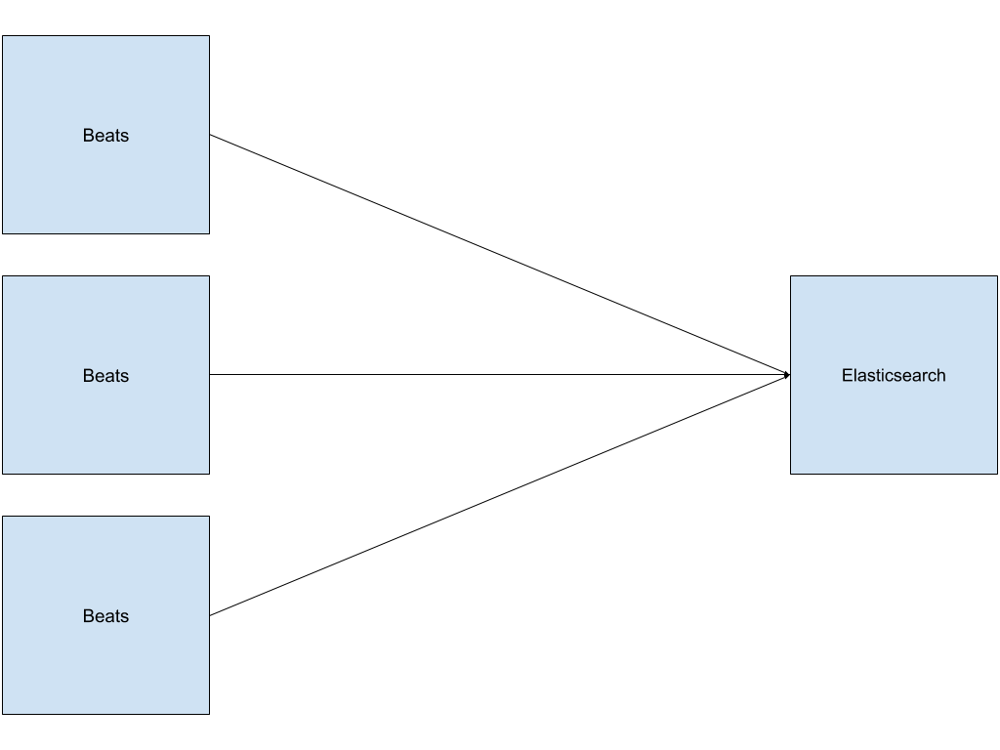
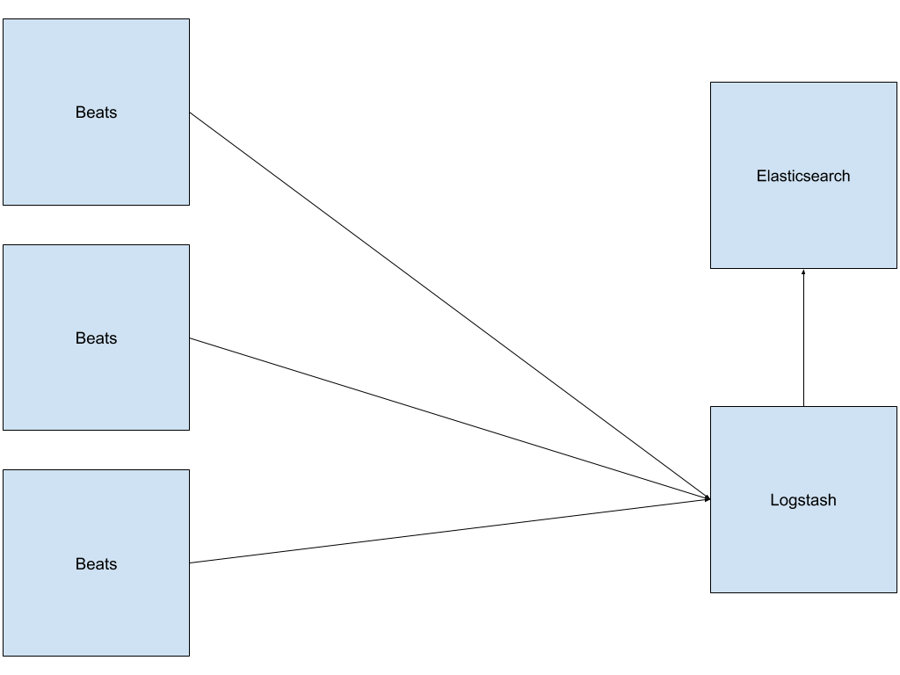
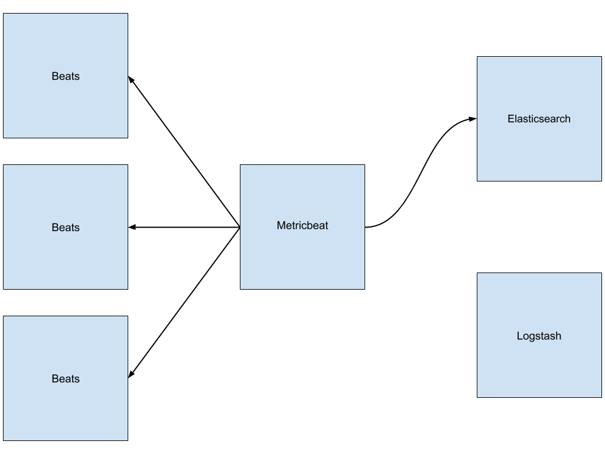
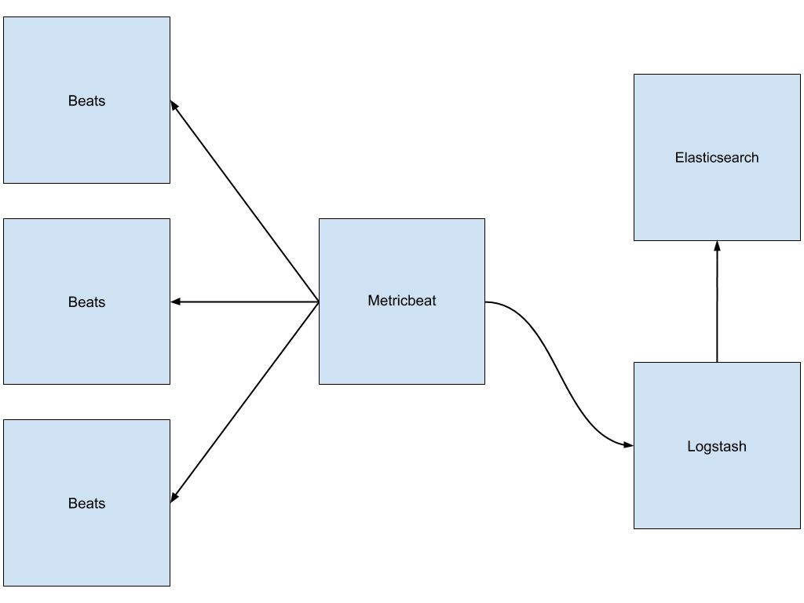

# Surveillance de l'installation
L'observabilité et le monitoring sont des éléments importants puisqu'ils permettent de voir en direct et de surveiller l'état des services, pour détecter un problème.
Dans kibana, il y 2 section: la section *Observability* qui contient les onglets *Logs*, *Metrics*, *APM*, *Uptime* et la section *Stack Monitoring* qui est dédier au logiciel de la suite ELK.

Nous allons voir dans un premier temps comment activer le monitoring des logiciels Elastic. Puis comment mettre en place l'observability pour les logiciels de la suite ELK et pour d'autre programme.

*Note: Le monitoring est une fonctionnalité x-pack, mais la plupart des fonctions sont disponible dans la licence basique.*
## Le monitoring
Le monitoring permet de connaitre le nombre de logiciels ELK actifs, leur état et d'avoir des statistiques d'utilisation.

### Configuration
#### Elasticsearch
Pour activer cette fonctionnalité, il faut rajouter ce paramètre dans le fichier de configuration:
```yaml
#/etc/elasticsearch/elasticsearch.yml
xpack.monitoring.collection.enabled: true
```

#### Kibana
Le monitoring est activer par défaut. Il est possible de modifier des paramètres dans le fichier de configuration `/etc/kibana/kibana.yml` en rapport avec le monitoring et l'affichage, mais nous en n'avons pas besoin.

#### Logstash
Il existe 2 méthodes pour envoyer les données de monotoring. Soit en passant par logstash (legacy), soit en passant par l'agent Metricbeat. <br>
Le monitoring est activer de base si une sortie logstash est spécifier dans une pipeline.<sup>A vérifier</sup>. Mais il est possible de configurer le monotoring dans le fichier de configuration `/etc/logstash/logstash.yml`

#### Beat
Il existe 2 méthodes pour envoyer les données de monotoring. Soit en passant par lui même (legacy), soit en passant par l'agent Metricbeat.

##### Legacy
 ou   <br>
L'agents Beat envoye ces données.<br>
Si le agents Beat est configuré pour envoyer des données à la sortie Elasticsearch, une seul ligne n'est qu'a modifier:
```yaml
#/etc/*beat/*beat.yml
monitoring.enabled: true
```

Si le agents Beat n'est pas configuré pour envoyer des données à la sortie Elasticsearch:
```yaml
#/etc/*beat/*beat.yml
monitoring.enabled: true
monitoring.elasticsearch:
  hosts: ["https://example2.com:9200"]
```

##### Metricbeat
 ou   <br>
Utilise l'agent Metricbeat pour envoyer les données.<br> 
*Note: non tester*

1. Configuration d'un agent Beat

```yaml
#/etc/*beat/*beat.yml
http.enabled: true
http.port: 5067 #(5066 default port monitoring)
monitoring.enabled: false
```

2. Configuration de l'agent Metricbeat

On active le module beat
```
# metricbeat modules enable beat-xpack
```
On le configure
```yaml
#/etc/metricbeat/modules.d/beat-xpack.yml
- module: beat
  metricsets:
    - stats
    - state
  period: 10s
  hosts: ["http://<adress>:5067"] #list
  xpack.enabled: true
```
Puis on configure la sortie (Logstash ou Elasticsearch)

### Problème
Il est possible qu'un agent beat n'apparaisse pas dans le cluster principale mais dans un autre cluster appelé "*Standalone Cluster*". Pour corriger ce problème ou pour le prévenir, il faut ajouter à la configuration de l'agent beat l'uuid du cluster Elasticsearch que l'on utilise pour le monitoring.
```json
GET _cluster/state/version
{
  "cluster_name" : "<cluster_name>",
  "cluster_uuid" : "<cluster_uuid>",
  "version" : 0,
  "state_uuid" : "<state_uuid>"
}
```
Ensuite, on ajoute l'uuid au fichier de configuration de l'agent beat.
```yaml
monitoring:
  cluster_uuid: "<cluster_uuid>"
```

### Note
Les données de surveillance sont stockées dans un index caché `.monitoring-<PROGRAMME>-<VERSION>-<DATE>`.<br>
*À vérifier:* il semble que ces données s'accumulent et ne soient pas automatiquement supprimées au bout de x temps.
La gestion du cycle de vie des données de monitoring est une fonctionnalité x-pack.

## L'observabiliter
*Note: brouillon*
### Logs
Ces logs seront stocker dans l'index `filebeat-<VERSION>-<DATE>-<ROLLOVER>`
### Metric
Pour ajouter des données metric, il faut installer l'agent Beat Metricbeat.
```
# metricbeat modules enable <nom_module>
```
On va tester avec les modules `elasticsearch-xpack`, `logstash-xpack`, et `system`.<br>
Modifier si necessaire l'host dans les fichiers de configuration des modules `/etc/metricbeat/module.d/<nom_module>`.<br>
On configure l'output sur elasticsearch.

Ces logs seront stocker dans l'index `metricbeat-<VERSION>-<DATE>-<ROLLOVER>`

### APM
### Uptime


# Source
- https://www.elastic.co/fr/blog/elastic-stack-monitoring-with-metricbeat-via-logstash-or-kafka
- https://discuss.elastic.co/t/filebeat-creates-a-standalone-cluster-in-kibana-monitoring/188663/5